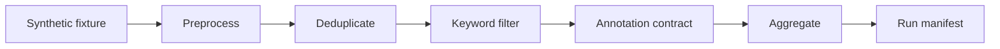

# Reddit Bias Perception

A privacy-aware research-engineering pipeline for studying how Reddit posts
discuss perceived visual-identity bias in AI-generated images.

[](https://github.com/nabinkim0318/reddit-bias-perception/actions/workflows/ci.yml)

The operational question is whether a post **discusses** unfair, distorted, or
missing portrayal of human identity in generated images — not whether an AI
system is objectively biased. A model `yes` does not prove objective AI bias.

## What this demonstrates

- **Failure-aware LLM annotation.** Successful `yes`/`no` labels are stored
  separately from parse and model failures, so execution errors cannot silently
  become scientific negatives.
- **Public-safe, provenance-backed execution.** The supported demo runs on
  fully synthetic fixtures, writes compact aggregates plus checksummed run
  manifests, and is covered by offline CI.
- **Human-validation tooling, not a claimed study.** Blinded sampling, double
  annotation, and agreement metrics ship as a reproducible framework; this
  repository does not claim a completed validation result.
- **Exploratory topic analysis with run-specific identities.** Topic IDs are
  local to a fit. Assignment agreement across seeds is measured without treating
  a partition as semantically valid.
- **Cluster-aware exploratory statistics.** Emotion scores are compared across
  mapped topic categories with subreddit-clustered covariance, FDR correction,
  and reported effect estimates with confidence intervals.

## Quick start

Requires Python 3.10–3.12 and [Poetry](https://python-poetry.org/).

```bash
poetry install --with=dev
make demo
```

Installing dependencies may need package-index access. After that, `make demo`
is runtime-offline: it uses fully synthetic data and does not need Reddit
credentials, a GPU, or a real LLM.

Optionally:

```bash
make test
```

### What `make demo` exercises



Equivalent command:

```bash
PYTHONPATH=. poetry run python -m processing.run_pipeline --synthetic \
  --input tests/fixtures/synthetic/posts.json \
  --output-dir artifacts/synthetic_demo
```

Outputs in `artifacts/synthetic_demo/` (gitignored):

- `synthetic_demo_aggregate.json` — compact counts only
- `synthetic_demo_manifest.json` — input checksum, code SHA, config hash, stage counts

The annotator is a deterministic stand-in (`synthetic-demo-annotator/v1`). The
demo does **not** call Reddit, load a real LLM, fit BERTopic, or reproduce
study findings. Outputs are pipeline-validation artifacts.

The demo reuses cached outputs only when the manifest matches the current
input checksum, config hash, and schema version **and** the recorded aggregate
SHA-256 still matches the file on disk. `code_sha` is stored for provenance but
is not a cache key, so a documentation-only commit does not by itself invalidate
a matching synthetic run.

## What this repository does not claim

- It does **not** detect whether AI image systems are objectively biased.
- A model `yes` is a prediction about **discussion**, not evidence of system-level bias.
- Keyword matches are not `yes` labels; failed parses are not `no`.
- `make demo` does not reproduce research findings.
- Shipping a human-validation **framework** is not a completed validation study.
- Topic-model and clustered-statistics modules are exploratory. They do not
  establish causal effects, Reddit representativeness, or semantic validity of
  topics.

## Construct

| Object | What it is |
|---|---|
| Reddit post | Observational unit: discourse about visual-identity portrayal in generated images |
| Model `pred_label` | Automated prediction of that discourse construct (`yes`/`no` on success only) |
| Human validation | Codebook + blinded protocol for evaluating those predictions |
| Objective AI-system bias | **Out of scope.** Not measured by this software |

The codebook construct is `visual_identity_bias_in_ai_generated_images`:
whether the post discusses unfair, distorted, or missing portrayal of human
identity (race, gender, body type, disability, age, culture) in AI-generated
images. See [docs/annotation_codebook.md](docs/annotation_codebook.md).

## Annotation contract

Few-shot labels are model predictions, not human-validated ground truth.

- On success, `pred_label` is `yes` or `no`.
- On parse or model failure, `pred_label` is null and `status` records the failure.
- Malformed replies are not guessed. Failures are never stored as `"no"`.
- Unsuccessful rows are excluded from yes/no prevalence denominators.

See [docs/llm_annotation.md](docs/llm_annotation.md). Artifacts without `status`
are a prior schema; re-run annotation rather than migrating them.

## Human validation

This repository includes a reproducible human-validation **framework** (blinded
deterministic sampling, double annotation, optional adjudication, agreement
metrics, and aggregate model-vs-human evaluation). See
[docs/human_validation_protocol.md](docs/human_validation_protocol.md).

- **No completed human-validation result is claimed by this repository.**
- Human `uncertain` and `insufficient_context` labels are counted but excluded
  from binary evaluation denominators. They are not forced into `yes`/`no`.
- Model `parse_error` / `model_error` rows are reported as execution failures
  and are never treated as scientific `"no"`.

Real validation task files remain local/private. Public tests use fictional
synthetic fixtures only.

## Public data policy

This Git tree distributes source code, configuration, schemas, documentation,
and synthetic fixtures. It does **not** distribute record-level Reddit text,
Reddit IDs, usernames, or permalinks.

Ordinary published branch history in a fresh clone has been sanitized of those
record-level artifacts. Residual GitHub-side caches of old pull-request refs
are a separate concern; see [docs/git_history_audit.md](docs/git_history_audit.md).

Real Reddit-derived corpora are obtained separately, remain on the researcher's
machine (typically under `data/`), and are **not** required for the public
synthetic demo. They must not be committed. This repository does **not** claim
that the full real-data workflow is reproducible from a clean clone.

The legacy runner `python -m processing.run_pipeline --subreddit <name>` still
exists for local private dumps. It may load a real LLM, assumes files under
`data/`, and resumes on file existence only (not provenance). It is not the
supported public command.

See [docs/data_statement.md](docs/data_statement.md) and
[tests/fixtures/synthetic/README.md](tests/fixtures/synthetic/README.md).

## Topic modeling

Sentiment analysis and BERTopic modules remain in `analysis/` for local
research. They are **not** part of the canonical demo and are not invoked by
`make demo` or `main.py`.

BERTopic is an **exploratory** tool. Topic identities are run-specific labels,
not stable scientific categories. Stochastic components (especially UMAP) use
an explicit configured seed; `nr_topics="auto"` remains an exploratory choice
and may yield different topic counts and outlier rates across seeds.

Structural assignment stability across configured seeds is summarized with a
label-permutation-invariant metric (Adjusted Rand Index). That measures
partition agreement, not semantic validity. A single topic solution does not
establish that the topics are meaningful, and this repository does **not**
claim a measured real-data BERTopic stability score unless a governed
multi-seed run on local data is completed separately.

Topic-to-category mappings are bound to a specific topic run. “Topic 3” from
seed A must not be labeled with the name that belonged to “Topic 3” from seed
B.

See [docs/topic_model_stability.md](docs/topic_model_stability.md). Real
fitting is local/research-only and is not part of `make demo` or default CI.

## Statistical analysis

Reddit posts are the observational units. Posts from the same subreddit are
not assumed independent. The supported exploratory path is

```text
emotion_score ~ C(mapped_topic_category)
```

with subreddit-clustered covariance when clustering is supportable. Multiple
emotion-level omnibus tests are Benjamini–Hochberg FDR-corrected. Effect
estimates and confidence intervals are reported; null results are not hidden.

Mapped topic categories are exploratory topic-derived groupings, not ground
truth. These analyses do not support causal inference, do not validate
BERTopic or GoEmotions, and do not treat Reddit discourse as a population
estimate.

See [docs/statistical_methodology.md](docs/statistical_methodology.md).
Importing `analysis.emotion_statistics` does not read research files. Default
CI uses synthetic tables only.

## Where to look

| Path | Role |
|---|---|
| `processing/` | Canonical pipeline, LLM contract, synthetic runner, provenance |
| `validation/` | Blinded sampling and human-vs-model evaluation |
| `analysis/` | Local topic modeling, stability, clustered emotion statistics |
| `tests/fixtures/synthetic/` | Fully synthetic public fixtures |
| `docs/` | Codebook, protocol, methodology, data statement |
| `artifacts/` | Generated demo output (gitignored) |

## Development commands

| Command | Description |
|---|---|
| `poetry install --with=dev` | Install runtime and development dependencies |
| `make format` | Run black and isort |
| `make check` | Check formatting and Poetry config |
| `make test` | Offline tests (`not slow and not integration_external`) |
| `make demo` | Canonical synthetic end-to-end workflow |

## Configuration

Environment variables and paths are defined in `config/config.py`. A `.env`
file is **not** required for `make demo`. Reddit and Hugging Face credentials
in `.env.example` are only for the local private-data runner.

Pipeline scripts may write record-level files under local `data/`. Those files
are local research artifacts and are gitignored. Public examples are synthetic
only (`tests/fixtures/synthetic/`).

## Tests

```bash
make test
```

Includes:

- Annotation-contract and parser tests
- Public-artifact privacy regression
- Synthetic end-to-end pipeline regression
- Human-validation framework tests (sampling, agreement, synthetic E2E)
- Topic-stability and BERTopic probability-assignment tests (no model download)
- Clustered emotion-statistics helpers and synthetic methodology E2E
- Other fast offline unit tests

Live Reddit API tests, model downloads, GPU jobs, and real BERTopic training are
not part of the default suite.

## Further reading

- [docs/annotation_codebook.md](docs/annotation_codebook.md) — human construct and labels
- [docs/llm_annotation.md](docs/llm_annotation.md) — parser and failure statuses
- [docs/human_validation_protocol.md](docs/human_validation_protocol.md) — validation framework
- [docs/topic_model_stability.md](docs/topic_model_stability.md) — topic identities and ARI
- [docs/statistical_methodology.md](docs/statistical_methodology.md) — clustered inference and FDR
- [docs/data_statement.md](docs/data_statement.md) — public vs local data
- [docs/git_history_audit.md](docs/git_history_audit.md) — history sanitization

## License

MIT License for the software in this repository (`pyproject.toml`). The license
does **not** grant rights to redistribute Reddit users' content. See
[docs/data_statement.md](docs/data_statement.md).
